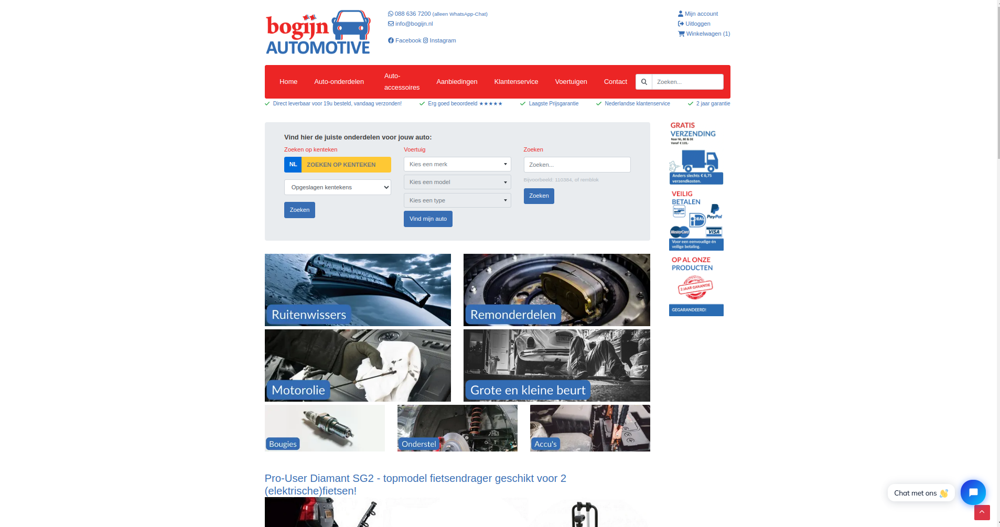
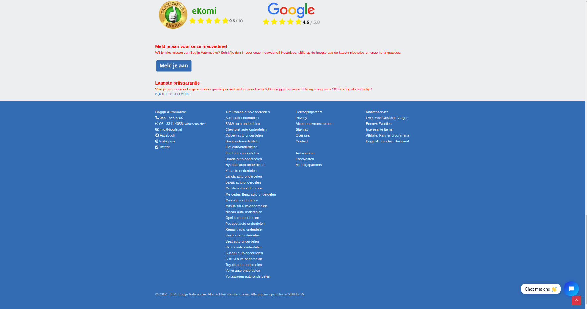
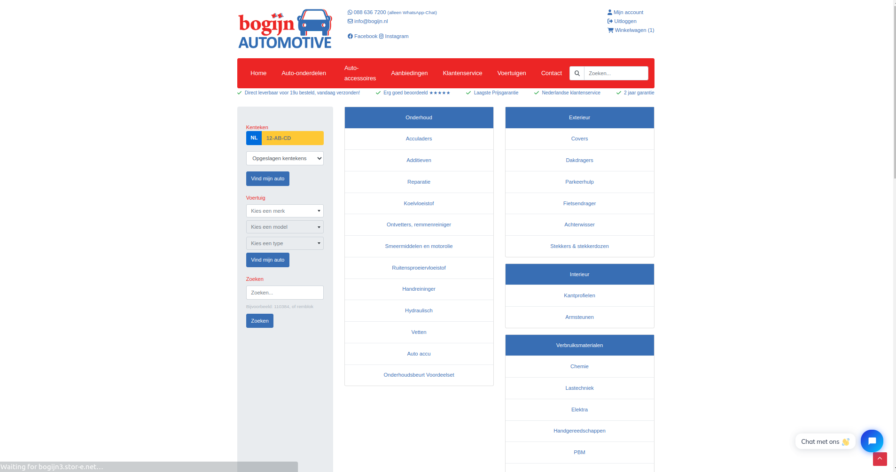

# Styling Bouwfaserapportage

Voor de styling heb ik het logo toegevoegd, font awesome iconen geimporteerd, de header nagemaakt, vehicle search gelijk gemaakt aan de jumbotron van bogijn2, veel scss overgenomen van bogijn2, dingen verwijderd uit het project die niet relevant waren aan bogijn qua layout en styling, en een aantal vertalingen toegevoegd. Tevens ook cms blokken neergezet waar deze horen.

Hier volgt resultaat:

Verder valt het resultaat op het moment van schrijven te bezichtigen op [de testserver](https://bogijn3.stor-e.net/)